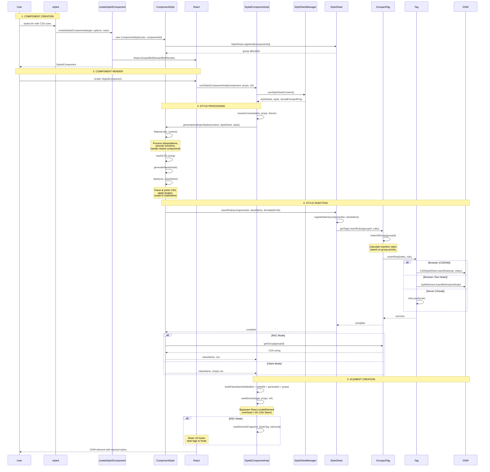

NOTE: CLAUDE.md is a symlink to this file (AGENTS.md). Edit AGENTS.md directly.

use pnpm package manager and associated commands
never run the dev server yourself, ask the user to start it if needed
use conventional commits: (feat|fix|chore|refactor|test|docs|style|perf|build|ci): [description]

styled-components - CSS-in-JS library for React with tagged template literals

Mandates

- React 16.8 compat
- Always microbenchmark to validate optimizations
- Optimize for low memory pressure and monomorphic functions

Agent rules

- Create changesets for public-facing changes
- Do not edit the CHANGELOG.md file, it is auto-generated by changesets
- Always run the formatter (`pnpm --filter styled-components prettier`) before committing code changes

Root Level

- `package.json` - Monorepo config with pnpm workspaces
- `README.md` - Main project documentation
- `CONTRIBUTING.md` - Setup guide and contribution guidelines
- `babel-preset.js`, `babel.config.js` - Shared Babel configuration

Packages

`packages/styled-components/src` - Main Library

- `base.ts` - Shared exports (warnings, utilities)
- `constants.ts` - Library constants (SC_ATTR, SC_VERSION)
- `constructors/constructWithOptions.ts` - Factory for custom configs
- `constructors/createGlobalStyle.ts` - Global styles API
- `constructors/css.ts` - css template literal helper
- `constructors/keyframes.ts` - Animation keyframes API
- `constructors/styled.tsx` - Main styled() API
- `hoc/withTheme.tsx` - Theme HOC
- `index.ts` - Main entry point, exports all public APIs
- `models/ComponentStyle.ts` - Style compilation & injection
- `models/GlobalStyle.ts` - Global style model
- `models/InlineStyle.ts` - Native inline styles
- `models/Keyframes.ts` - Keyframe animation model
- `models/ServerStyleSheet.tsx` - SSR style collection
- `models/StyledComponent.ts` - Core styled component class
- `models/StyleSheetManager.tsx` - Style sheet configuration
- `models/ThemeProvider.tsx` - Theming context & hooks
- `native/index.ts` - React Native entry point
- `sheet/dom.ts` - DOM-specific sheet operations
- `sheet/GroupedTag.ts` - Grouped tag optimization
- `sheet/GroupIDAllocator.ts` - Component ID allocation
- `sheet/Rehydration.ts` - SSR hydration logic
- `sheet/Sheet.ts` - Style sheet abstraction
- `sheet/Tag.ts` - DOM style tag manipulation
- `types.ts` - TypeScript type definitions
- `utils/flatten.ts` - Style processing
- `utils/interleave.ts` - Style processing
- `utils/stylis.ts` - Style processing

`packages/sandbox/` - Next.js Test Environment

Structure

- `app/` - Next.js App Router
  - `layout.tsx` - Root layout with registry
  - `page.tsx` - Server component example
  - `client-example/page.tsx` - Client component example
  - `lib/registry.tsx` - StyledComponentsRegistry for RSC

`packages/benchmarks/` - Performance Testing

Performance benchmarks comparing CSS-in-JS libraries

- `src/implementations/` - Different library implementations
  - `styled-components` (v5, v6, object syntax)
  - `emotion`, `goober`, `aphrodite`, `styletron`, etc.
- `src/cases/` - Benchmark test cases (SierpinskiTriangle, Tree)
- `src/app/` - Benchmark UI components

- `src/utils/errors.md` - Error code documentation

Key Commands

- `pnpm build` - Build main package
- `pnpm test` - Run all tests
- `pnpm --filter sandbox dev` - Start Next.js dev server
- `pnpm --filter styled-components test:web` - Test web build
- `pnpm --filter styled-components test:native` - Test React Native
- `pnpm --filter styled-components bench` - Run performance benchmarks

Performance Optimization Learnings

Microbenchmark-validated patterns (V8/Node.js):

- String accumulation: `+=` is 3-4x faster than `array.push() + join()` for 5-10 parts
- Object creation: spread `{...props, theme}` is 4x faster than `Object.assign` or `for..in` copy
- Props iteration: `for..in` is 1.7x faster than `Object.keys()` + loop
- RegExp creation: `new RegExp()` costs ~50ns; caching via Map is 5x faster for repeated selectors; indexOf check to skip entirely is 5x more
- Stylis middleware: pre-building saves only ~8% since `compile+serialize` dominates cost
- Return value reuse: sub-nanosecond difference, not worth the complexity
- Flatten output: reusing the result array vs fresh allocation shows no measurable difference (flatten execution time dominates)
- Template literals: manual `+` concat is 1.3x faster than `` `${a}${b}` `` in tight loops (template overhead)
- String accumulation at SSR scale: `+=` is STILL faster than `array+join` even at 500 iterations (V8 cons string trees)
- React.createElement: raw element objects are 60-120x faster; `$$typeof` symbol detected at module load from installed React version

V8-specific gotchas:

- `new Array(n)` creates HOLEY_ELEMENTS arrays that infect V8 type feedback — 3.9x regression observed in GroupedTag
- `private` modifier is not allowed on anonymous class expressions (`export const Foo = class { ... }`)
- `import type * from 'stream'` still triggers bundler module resolution even though TypeScript strips it

Build architecture:

- `__SERVER__` build-time constant enables dead-code elimination for SSR paths in browser builds
- `IS_BROWSER` (`typeof window !== 'undefined'`) is a runtime check — bundlers CANNOT tree-shake code behind it
- The `browser` field in package.json maps server bundles to browser-specific alternatives for bundler resolution
- `exports` field caused TS2742 in composite projects and ordering confusion; `browser` field is preferred

Dynamic re-render hot path (most expensive → least):

1. `stylis` compile+serialize: ~1-5µs depending on CSS size (unavoidable, external library)
2. `flatten()` interpolation evaluation: ~2-5µs for 5 interpolations (unavoidable, user functions)
3. `phash()` hashing: ~0.3µs per CSS string (unavoidable)
4. String accumulation / array operations: 0.05-0.2µs (optimizable)
5. Cache lookups (`hasNameForId`, `generateName`): negligible

Rendering Flow - Update this diagram as the library is edited.

